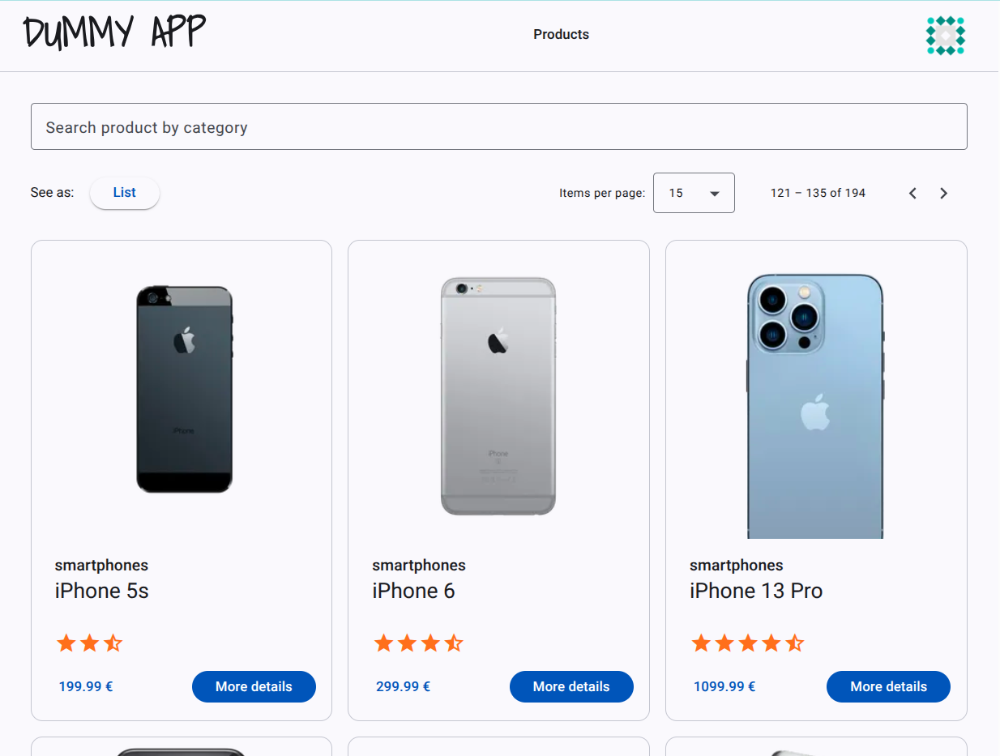
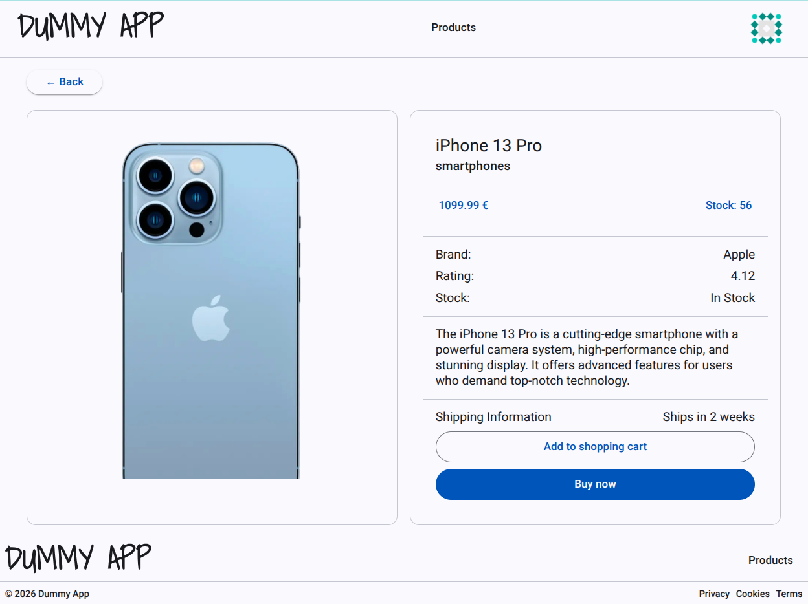
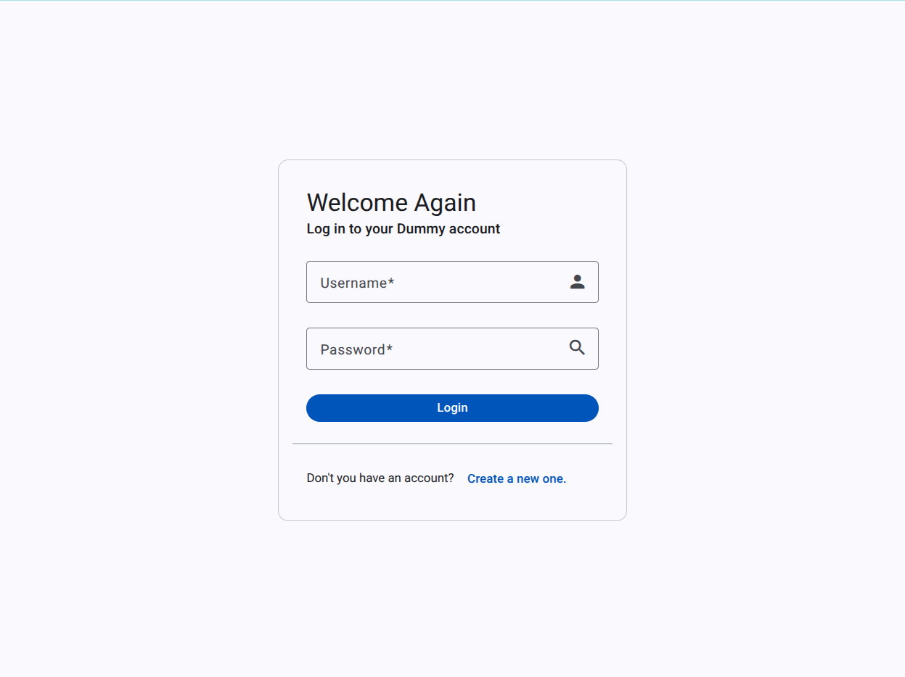

# Dummy App

**Angular E-Commerce Demo**

This project is a functional e-commerce simulation that showcases my proficiency in building Single Page Applications (SPAs). It serves as a technical demonstration of scalable Front-End architecture, featuring authentication flows, reactive state management, and reusable UI components.

1. [About the Project](#about-the-project)
2. [Tech Stack](#tech-stack)
3. [Gallery & Demo](#galery-&-demo)
4. [Challenges & Learnings](#challenges-&-learnings)
5. [Acknowledgments](#acknowledgments)
6. [Author](#author)

# About the Project

**Dummy App** was born as an exercise to consolidate advanced Angular and RxJS concepts. The application allows users to browse products, filter categories, manage a shopping cart, and handle user authentication securely.

The main goal was not just to prioritize code maintainability, error handling, and visual consistency, ensuring that the application behaves like a production-ready product.

# Tech Stack

The core of the application is Angular, supported by a strictly typed ecosystem:

- Frontend Framework: Angular (Latest features, Standalone Components).

- Styling: SCSS (SASS).

- State Management: RxJS (BehaviorSubjects for Cart and Auth state).

- Authentication: JWT (JSON Web Tokens), Route Guards, and HTTP Interceptors.

- UX/UI: Custom skeleton loaders, modal components, and responsive grid layouts.

- Routing: Angular Router with lazy loading strategies.

# Gallery & Demo

- Live Demo: https://dummy-app-jade.vercel.app/

## Product List

## Product Details

## Login

# Challenges & Learnings

Durante el desarrollo de este proyecto, me enfrenté a desafíos técnicos que me permitieron profundizar en arquitecturas modernas:

1. 🔐 Robust Authentication Flow

Managing user sessions securely is critical.

Challenge: Persisting the login state across reloads and handling token expiration gracefully.

Solution: I implemented a specialized AuthService combined with HTTP Interceptors. The TokenInterceptor attaches the JWT to requests automatically, while the ErrorInterceptor catches 401 errors to redirect the user, ensuring a seamless security layer.

2. 🛒 Reactive State Management (RxJS)

Sharing data like the "Cart Count" between the header and the product list can be messy.

Learning: I moved away from "Prop Drilling" and embraced RxJS.

Result: By using BehaviorSubjects in the CartService, the application reacts instantly to changes. Adding an item updates the header counter immediately, decoupling the components and making the architecture much cleaner.

3. 📱 Advanced Component Reusability

I didn't want to rewrite code for similar views.

Implementation: I designed "Dumb Components" like product-card and toggle-button that rely solely on inputs and outputs. This separation of concerns allowed me to reuse the same card logic for the Grid View, List View, and Cart summary without duplicating logic.

4. 🛠️ From Coding to Engineering

Perhaps the most valuable lesson was structuring the project for scale. Organizing the folder structure by features (Pages vs. Components vs. Services), setting up Environment variables for development/production, and strictly typing models with TypeScript taught me the discipline required for enterprise-level software.

# Acknowledgments

This project wouldn't have been possible without the guidance of my mentors and peers from **Insinno**, **Jose Gonzalez** and **Andrés Torrejón**.

A special thanks to **José Joaquín (Pepe)** for check code and give me advices about the functionality.

# Author

**Víctor Outeiro** - Full-stack Web Developer

- Portfolio Web: https://victor-outeiro.vercel.app/

- LinkedIn: https://www.linkedin.com/in/victor-outeiro/

- GitHub: https://github.com/Radu-A
